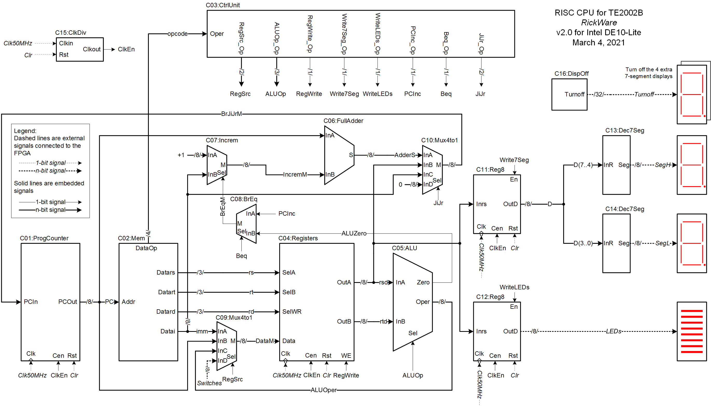
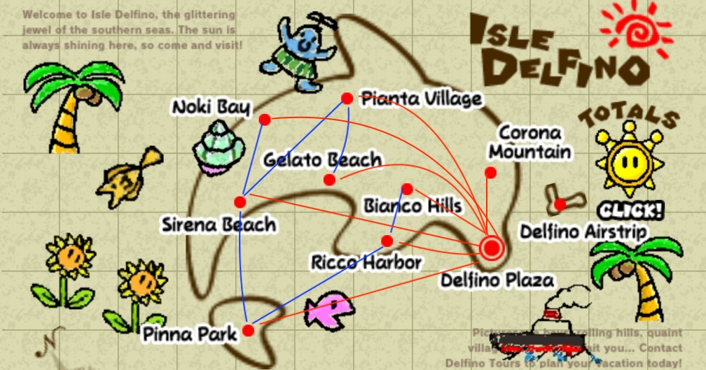

# israel_portfolio

## [Project 1: WAV Player](https://github.com/israel-iap/WAV_player)

Low-cost microcontroller system for music reproduction
Designed with displaying song information, pausing, rewinding and skipping features.
Implemented in C for the Atmega2560 chip.

This system has the following functions:

- Play songs in WAV format from an SD card, either mono or stereo.
- Capable of playing 6 KHz, 22.050KHz o 24 KHz of sampling rate
- Print song information in LCD display
- Play 6 different songs
- Pause/play, skip and rewind buttons

And here's the electric diagram

## [Project 2: Line Follower ARDrone 2](https://github.com/israel-iap/line_follower_ardrone2)

Algorithm for Parrot ARDrone 2 to follow a line in simulation and in hardware
Made use of simulation platform Gazebo and ROS Melodic tools.
Implementation was done in Python, with OpenCV, tum_simulator and ardrone_autonomy packages.

## [Project 3: Soft Processor](https://github.com/israel-iap/VHDL_soft_processor)

Basic RISC processor implementation in FPGA board
Implemented ALU, Program Counter, Main Memory, Registers, Displaying of numbers, and a Clock Divider.
Written in VHDL and Verilog for the Intel DE10-Lite board.

### Video evidence

<https://youtu.be/A8B5e8G9Opg>

## [Project 4: Smart Home Access](https://github.com/israel-iap/IoTProject)

Face recognition-based home security system with backend API and webapp
Collaborated in developing backend Python script for further deployment.
Implemented communication between webcam and a Firebase server for face detection in C++

## [Project 5: Isle Delfino Map](https://github.com/israel-iap/IsleDelfino_DataStructures/tree/master/ActIntegral4)

This program presents a board with some locations, some of them can be given by the user. The way of storing locations is ina Red-BLack tree, so it is sorted. And you can keep track of the locations you have visited in a Splay Tree. The referece map is the following:

